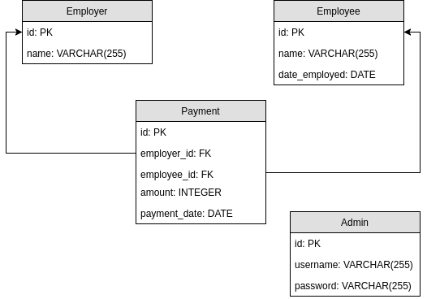

# Client Payroll

This application provides a system for the client to manage the payroll of their employees.

## Installation

```bash
$ pip install -r requirements.txt
$ pip install -e .
$ export FLASK_APP=app
$ export FLASK_DEBUG=1
$ flask run
* Serving Flask app "app"
* Forcing debug mode on
* Running on http://127.0.0.1:5000/
```

## Project Specification

### Objectives

1. To provide the client a system that allows them to view, update, and log the payments made to their employees.

2. To create a secure environment that only the client has access to sensitive data.

3. To give the client meaningful information about the spendings made throughout the project.

### User Roles

* The **ADMIN** - the admin is the sole user of the application. They are given login credentials that gives them total control of all the transactions inside the application. The admin is responsible with

    * creating `Employee` accounts
    * creating `Employer` accounts
    * updating / deleting `Employee` and `Employer` data.
    * processing payments.

### Diagrams



### Project Timeline

See [Milestones](https://github.com/alchermd/client_payroll/milestones).

### License

Released under [MIT License](/LICENSE)